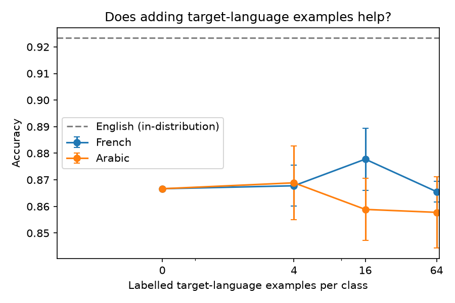

# Does a classifier trained in English survive a language shift?

A small experiment with **Cohere multilingual embeddings** on a question from my PhD
research (decision support under distribution shift):

> When a model is trained on data from one setting and deployed in another,
> how much accuracy is lost, **does its confidence still mean anything**, and
> what is the cheapest way to recover?

The setting here is language: a sentiment classifier is trained **only on English**
product reviews and tested on **French** and **Arabic**.

## What it measures

| Question | Metric |
|---|---|
| Q1. How much does accuracy drop across languages? | accuracy, macro-F1 |
| Q2. Can we trust the model's confidence after the shift? | ECE (calibration error), overconfidence = mean confidence − accuracy |
| Q2b. Does abstaining on uncertain cases help? | accuracy when the model answers only its 80% most confident cases |
| Q3. How many target-language labels close the gap? | accuracy with 0 / 4 / 16 / 64 labelled examples per class (3 seeds) |

Pipeline: `text → Cohere Embed (embed-multilingual-v3.0, input_type=classification) → logistic regression`.
Embeddings are cached on disk, so a full run costs about 20 API calls and re-runs cost none.

## Results

See [`results/results.md`](results/results.md) and the plot below (generated by `python run.py`).



### Findings (`embed-multilingual-v3.0`, 300 English examples per class, 150 test examples per class and language)

| Test language | Accuracy | ECE | Mean confidence − accuracy | Accuracy when abstaining on 20% least confident |
|---|---|---|---|---|
| English (in-distribution) | 0.923 | 0.147 | −0.133 | 0.988 |
| French (shifted) | 0.867 | 0.167 | −0.167 | 0.917 |
| Arabic (shifted) | 0.867 | 0.162 | −0.162 | 0.925 |

1. **The language shift costs about 5–6 accuracy points** (92.3% → 86.7% for both French and Arabic).
   With 300 test examples per language the 95% intervals are roughly ±4 points and only just
   overlap, so the drop is likely real but its exact size is uncertain.
2. **The model is under-confident, not over-confident.** Mean confidence is 13–17 points *below*
   accuracy in every language. This goes against the common assumption that models become
   over-confident under shift; here, the regularised logistic regression on normalised embeddings
   produces soft probabilities. Calibration is slightly worse after the shift (ECE 0.147 → 0.16–0.17).
3. **Confidence still ranks errors well after the shift, so abstention recovers the gap.** Answering
   only the 80% most confident cases brings French and Arabic to 91.7–92.5%, the English
   zero-shot level. For a decision-support system, "defer to a human when unsure" is a cheap and
   effective safeguard here.
4. **Adding labelled target-language examples did not measurably help.** Adding 4, 16 or 64 per class
   left accuracy between 85.8% and 87.8% (baseline 86.7%), within seed noise. The multilingual
   embedding space already aligns the languages; the remaining errors are probably not
   language-specific (e.g. differences between review sources or ambiguous labels).

**Next steps I would try:** temperature scaling to fix the under-confidence; per-language error
analysis of the remaining mistakes; comparing `embed-v4.0`; a shift in domain as well as language.

## Run it

**Windows, one click:** double-click `run_windows.bat`. It creates a virtual environment,
installs the requirements, runs the tests, asks for your Cohere key once and runs the experiment.

**Manual:**

```bash
pip install -r requirements.txt
```

1. Create a free trial key at <https://dashboard.cohere.com/api-keys>.
2. Copy `.env.example` to `.env` and paste the key after `COHERE_API_KEY=`.
   (`.env` is in `.gitignore`, so the key is never committed.)
3. Run:

```bash
python run.py                    # binary sentiment (positive / negative)
python run.py --three-class      # optional: include neutral
python run.py --model embed-v4.0 # optional: compare another Cohere model
```

Offline check (no key, fake embeddings, synthetic data):

```bash
python -m pytest -q
```

## Data

[`tyqiangz/multilingual-sentiments`](https://huggingface.co/datasets/tyqiangz/multilingual-sentiments)
on Hugging Face (English, French and Arabic configurations), with balanced random samples per class.
If the automatic download fails, save each split as `{lang}_{split}.csv` (columns `text,label`)
and pass `--data-dir`.

## Limitations

- One dataset, one task, and a linear classifier on frozen embeddings; the numbers show a trend and
  are not a benchmark.
- The test sets are 300 examples per language (95% intervals of about ±4 points), so small
  differences are within noise (see the standard deviations across seeds).
- The few-shot points vary only which target examples are added; the English training set and the
  test sets are fixed, so the error bars understate the full uncertainty.
- The sources of the English, French and Arabic reviews differ, so the shift is language plus
  domain, not language alone.

## Project layout

```
shiftlab/data.py        loading and balanced sampling
shiftlab/embed.py       Cohere embedder with disk cache (+ offline fake for tests)
shiftlab/metrics.py     accuracy, ECE, accuracy at coverage (abstention)
shiftlab/experiment.py  the experiment and report generation
run.py                  command-line entry point
tests/                  offline tests with synthetic data
```
